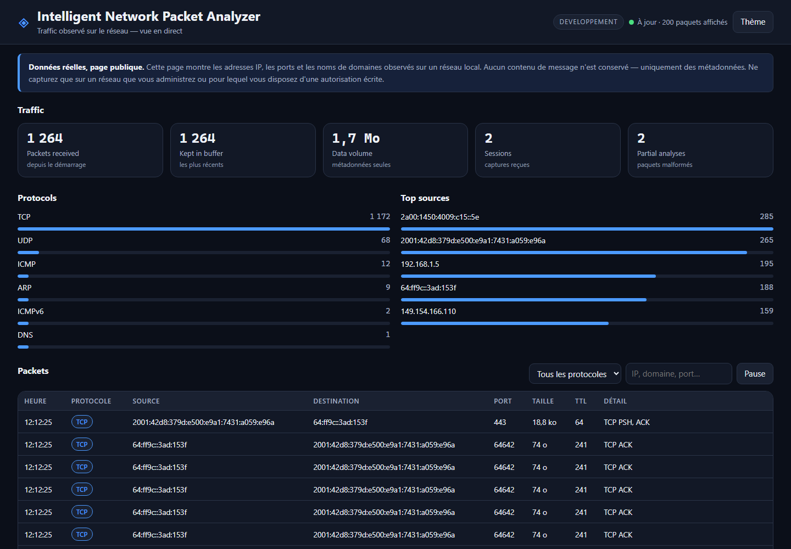

# Intelligent Network Packet Analyzer

> **État : phase 1 sur 5.** Ce dépôt contient ce qui est construit et vérifié à ce jour :
> la capture réelle, l'analyse des paquets, la transmission et l'affichage en direct.
> Les communications regroupées, les explications, la détection, l'enrichissement et la
> base de données arrivent dans les phases suivantes — le README est mis à jour à chaque
> phase, et la section « Limites » dit exactement ce qui n'existe pas encore.

Capturer le trafic réseau, le structurer, le comprendre, et l'expliquer à quelqu'un qui
n'est pas spécialiste.

---

## Présentation

Un serveur en ligne ne peut pas voir le trafic d'un réseau local : les paquets destinés à
une machine de ce réseau ne quittent jamais ce réseau. L'outil est donc coupé en deux.

- Un **agent local** (Python + Scapy) capture les paquets, les analyse, et envoie des
  **métadonnées** — jamais de contenu — à un backend, sur une connexion chiffrée,
  authentifiée par un jeton.
- Un **backend en ligne** (FastAPI) reçoit ces fiches, les conserve et les présente dans
  un tableau de bord public.

Un **mode replay** (import d'un fichier `.pcap`) permettra de rejouer une capture pour des
tests reproductibles. Il arrive après la phase 2, quand le format d'entrée sera figé.

## Aperçu



*Capture réelle : 1 264 paquets reçus d'un agent sur réseau Wi-Fi, IPv4 et IPv6 mêlés,
six protocoles identifiés.*

## Fonctionnement

```
   ┌──────────────────── VOTRE RÉSEAU ────────────────────┐
   │                                                      │
   │   [box] ──── Wi-Fi ────┬──── [téléphone]             │
   │                        │                             │
   │                   [votre poste]                      │
   │                        │                             │
   │                   ┌────▼─────────────────┐           │
   │                   │  AGENT LOCAL         │           │
   │                   │  capture  (Scapy)    │           │
   │                   │  analyse  (parser)   │           │
   │                   │  envoi    (file)     │           │
   │                   └────┬─────────────────┘           │
   └────────────────────────┼─────────────────────────────┘
                            │  HTTPS + jeton d'agent
                            │  (métadonnées uniquement)
   ┌────────────────────────▼─────────────────────────────┐
   │                    EN LIGNE                          │
   │   BACKEND FastAPI                                    │
   │     /api/v1/ingest   ← écriture protégée             │
   │     /api/v1/packets  → lecture publique              │
   │     tableau de bord (Jinja2 + JavaScript)            │
   └──────────────────────────────────────────────────────┘
```

## Architecture du dépôt

```
network-analyzer/
  agent/                # tourne sur votre machine
    capture.py          #   lister/choisir une interface, démarrer/arrêter, droits
    parser.py           #   paquet Scapy → fiche structurée, jamais d'exception
    sender.py           #   file d'attente bornée, regroupement par lots, réessai
    main.py             #   ligne de commande, assemblage, compteurs
  backend/              # tourne en ligne
    main.py             #   application, pages, traitement des erreurs
    api/
      ingestion.py      #   POST /ingest  (jeton obligatoire)
      paquets.py        #   GET  /packets, /stats, /sessions, /health
    config.py           #   lecture des réglages et des secrets
    models.py           #   validation Pydantic : le contrat avec l'agent
    storage.py          #   conservation (mémoire en phase 1, Supabase en phase 5)
    securite.py         #   jeton d'agent, limitation de débit
    dependances.py      #   ce que les routes reçoivent (remplaçable en test)
  web/
    templates/          #   page du tableau de bord, page d'erreur
    static/             #   feuille de style, script
  tests/                #   pytest : paquets forgés, API, file d'attente
  docs/
    DEFENSE.md          #   dossier de soutenance
    SCENARIOS-TEST.md   #   dix scénarios manuels et leur résultat attendu
  requirements.txt
  .env.example
```

## Technologies, et pourquoi

| Bibliothèque | Rôle | Pourquoi elle, et ce qu'elle coûte |
|---|---|---|
| **Scapy** | capture et décodage | décode Ethernet, IP, TCP, UDP, DNS, ARP, ICMP, IPv6. L'écrire soi-même serait plusieurs milliers de lignes et autant d'erreurs. **Coût :** lent — inadapté au-delà de quelques centaines de Mbit/s. |
| **FastAPI** | serveur HTTP | la validation vient des types, et la documentation OpenAPI est produite automatiquement : l'API est démontrable sans effort. **Coût :** plus de notions à connaître que Flask. |
| **Uvicorn** | serveur d'exécution | standard, éprouvé, asynchrone. |
| **Pydantic** | validation | refuse à l'entrée une adresse IP impossible ou un port hors bornes, en nommant le champ fautif. **Coût :** une étape de plus à écrire, payée au premier incident. |
| **httpx** | appels sortants | un délai maximal en une ligne : sans lui, un backend injoignable bloque l'agent. |
| **Jinja2** | gabarits HTML | fourni avec FastAPI, aucune compilation. |
| **python-dotenv** | secrets | aucun secret dans le code ; le fichier `.env` n'est jamais versionné. |
| **pytest** | tests | 65 tests, exécutés en dix secondes. |
| **Npcap** | pilote Windows | *externe, non Python.* Scapy en a besoin sous Windows ; c'est lui qui parle à la carte réseau. |

Aucune bibliothèque compilée n'est requise côté Python. Aucune n'impose de compte en ligne
pour la phase 1.

## API

| Méthode | Adresse | Droit | Rôle |
|---|---|---|---|
| `POST` | `/api/v1/ingest` | **jeton d'agent** | recevoir un lot de paquets |
| `GET` | `/api/v1/packets` | public | derniers paquets, filtrables (`limite`, `protocole`, `session`, `recherche`) |
| `GET` | `/api/v1/stats` | public | compteurs, répartitions, classements |
| `GET` | `/api/v1/sessions` | public | sessions de capture reçues |
| `GET` | `/api/v1/health` | public | état du service |

Documentation interactive produite par FastAPI : `http://127.0.0.1:8000/docs`

**Pourquoi le jeton est dans un en-tête et non dans l'adresse :** une adresse est
journalisée par tous les intermédiaires (proxy, hébergeur, journaux du navigateur). Un
en-tête ne l'est pas.

**Pourquoi l'écriture est protégée et la lecture ouverte :** le tableau de bord est public
par décision du projet. Ce qui doit être protégé, c'est l'écriture — sans jeton, n'importe
qui pourrait remplir la base de paquets inventés, et le tableau de bord deviendrait un
écran de fiction.

## Base de données

**Phase 1 : aucun stockage persistant.** Les paquets vivent dans un tampon circulaire
borné, en mémoire, et disparaissent au redémarrage. C'est un choix assumé : la phase 1
prouve la plomberie, la phase 2 établit le schéma à partir de ce qu'on manipule vraiment,
et la phase 5 le branche sur Supabase (PostgreSQL hébergé).

Le stockage est déjà isolé derrière une classe, `backend/storage.py`. Les routes ne
connaissent que ses méthodes : la bascule vers Supabase ne les touchera pas.

## Installation

**Prérequis :** Python 3.11 ou plus, et le pilote **Npcap** sous Windows
(https://npcap.com/#download — pendant l'installation, décocher « Restrict Npcap driver's
access to Administrators only » si l'on souhaite capturer sans élever les droits).

```bat
git clone <adresse-du-depot>
cd network-analyzer

python -m venv .venv
.venv\Scripts\python.exe -m pip install -r requirements.txt

copy .env.example .env
```

Renseigner ensuite `ANALYZER_AGENT_TOKEN` dans `.env`, en engendrant une valeur :

```bat
.venv\Scripts\python.exe -c "import secrets; print(secrets.token_urlsafe(32))"
```

Sans jeton renseigné, le backend en engendre un au démarrage et l'affiche dans la console —
pratique pour un essai, à éviter en production puisque le jeton changerait à chaque
redémarrage.

## Utilisation

**1. Le backend**, dans un premier terminal :

```bat
.venv\Scripts\python.exe -m backend.main
```

Le tableau de bord est sur `http://127.0.0.1:8000`.

**2. Quelle interface capturer ?**

```bat
.venv\Scripts\python.exe agent\main.py --interfaces
```

**3. Vérifier la capture, sans rien envoyer :**

```bat
.venv\Scripts\python.exe agent\main.py --interface "Wi-Fi" --a-blanc
```

**4. Capturer et transmettre :**

```bat
.venv\Scripts\python.exe agent\main.py --interface "Wi-Fi" ^
    --backend http://127.0.0.1:8000 --jeton <JETON>
```

Options utiles : `--duree 30` (arrêt automatique), `--filtre "tcp or udp"` (filtre BPF),
`-v` (journal détaillé).

> **Autorisation.** Ne capturez que sur un réseau que vous administrez, ou pour lequel
> vous disposez d'une autorisation écrite. Capturer le trafic d'un réseau qui ne vous
> appartient pas est illégal.

## Tests

```bat
.venv\Scripts\python.exe -m pytest tests/ -q
```

**65 tests**, dont :

- **parseur** — poignée de main TCP complète, SYN sans réponse, RST, DNS (question et
  réponse), mDNS sans section question, ICMP, ARP, UDP, IPv6, paquet tronqué, protocole
  inconnu, charge utile binaire, scan de ports forgé ;
- **modèles** — adresse impossible, port hors bornes, TTL hors bornes, champ inconnu,
  texte non borné, et un **test de contrat** vérifiant que ce que l'agent produit est
  accepté par le backend ;
- **API** — écriture sans jeton, avec un faux jeton, avec le bon ; lot vide ; paquet
  invalide ; filtres et recherche ; limitation de débit ;
- **file d'attente** — regroupement par lots, débordement borné, backend injoignable,
  réponse d'erreur non prise pour un succès.

Dix scénarios manuels, avec leur résultat attendu, sont décrits dans
[`docs/SCENARIOS-TEST.md`](docs/SCENARIOS-TEST.md).

## Limites actuelles

Rédigées honnêtement, comme demandé. **Aucune de ces limites n'est cachée par le code :
ce qui n'est pas fait n'est pas simulé.**

- **Pas de regroupement en communications (flows)** — chaque paquet est affiché isolément.
  Impossible, en l'état, de dire « cette machine a ouvert 40 connexions en dix secondes ».
  *Phase 2.*
- **Pas d'explication en langage humain** — « TCP 443 » est affiché, pas expliqué.
  *Phase 3.*
- **Pas de détection** — un scan de ports est visible dans les données, mais rien ne le
  signale. *Phase 4.*
- **Pas d'enrichissement** — aucune adresse n'est rattachée à un pays ou à une
  organisation. *Phase 4.*
- **Pas de persistance** — tout est perdu au redémarrage du backend, et le tampon est
  borné à 2 000 paquets. *Phase 5.*
- **Pas de déploiement** — tout tourne en local. *Phase 5.*
- **Pas de mode replay** — le fichier `.pcap` n'est pas encore importable.
- **Performance** — Scapy décode en Python pur. Sur un réseau domestique c'est sans
  conséquence ; sur un lien chargé, des paquets sont perdus par le pilote, sans que
  l'analyseur puisse le savoir.
- **Un avertissement de bibliothèque** — FastAPI signale que `httpx` avec son client de
  test est déprécié au profit de `httpx2`. Cela ne concerne que les tests, aucune
  bibliothèque n'étant installée pour la production.
- **Une limite de fond, qui vaut d'être dite** : l'analyseur ne voit que ce que sa carte
  réseau reçoit. En mode normal, cela exclut le trafic des autres machines. Ici, la carte
  reçoit aussi des trames d'autres appareils du Wi-Fi — ce qui est utile pour la
  démonstration, mais ne constitue pas une surveillance fiable et complète du réseau.

## Licence et avertissement

Exercice de formation. Les données affichées par le tableau de bord sont réelles :
adresses IP, ports et noms de domaines d'un réseau local. Aucun contenu de message n'est
conservé.

Ne capturez que sur un réseau que vous administrez, ou pour lequel vous disposez d'une
autorisation écrite.
