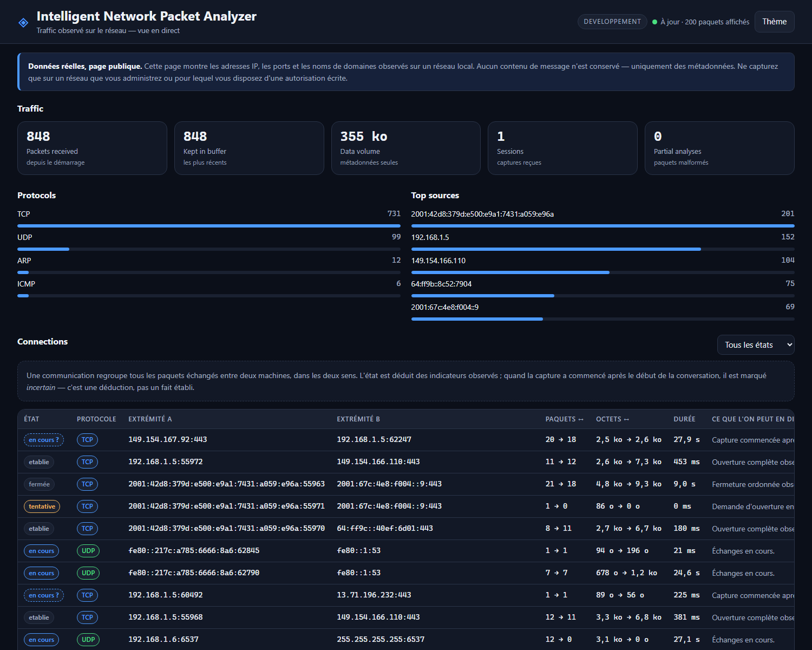
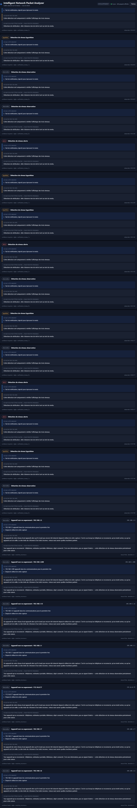
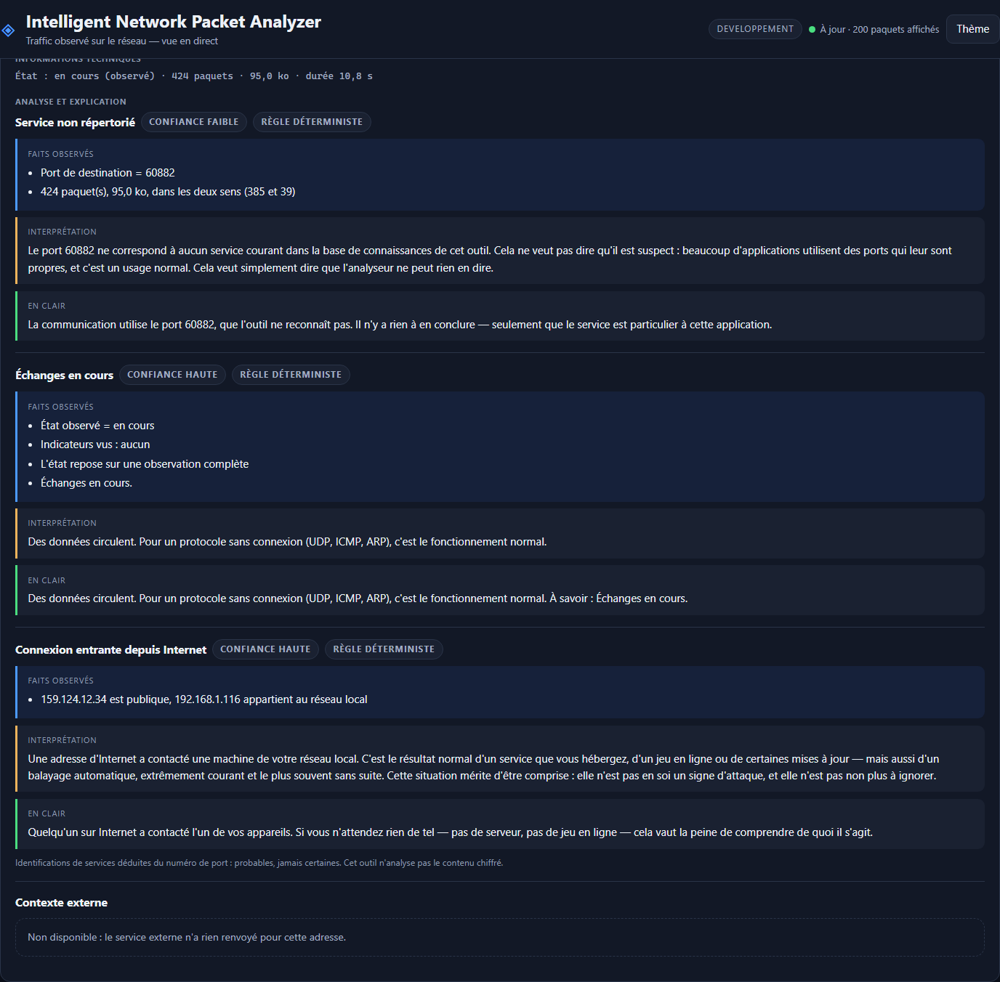

# Intelligent Network Packet Analyzer

> **État : projet complet — les cinq phases sont livrées, et le lot A d'améliorations
> (filtres d'affichage, légende, vue par couche, export) les rejoint.** Capture réelle,
> analyse des paquets, communications avec déduction d'état, explications en langage
> humain, détection sur trois niveaux, enrichissement par API externe, mode replay
> `.pcap`, persistance PostgreSQL (donc Supabase). — le README est mis à jour à chaque phase, et la
> section « Limites » dit exactement ce qui n'existe pas encore.

Capturer le trafic réseau, le structurer, le comprendre, et l'expliquer à quelqu'un qui
n'est pas spécialiste.

---

## Présentation

Un serveur en ligne ne peut pas voir le trafic d'un réseau local : les paquets destinés à
une machine de ce réseau ne quittent jamais ce réseau. L'outil est donc coupé en deux.

- Un **agent local** (Python + Scapy) capture les paquets, les analyse, et envoie des
  **métadonnées** — jamais de contenu — à un backend, sur une connexion chiffrée,
  authentifiée par un jeton.
- Un **backend en ligne** (FastAPI) reçoit ces fiches, les conserve et les présente dans
  un tableau de bord public.

Un **mode replay** (import d'un fichier `.pcap`) permettra de rejouer une capture pour des
tests reproductibles. Il arrive après la phase 2, quand le format d'entrée sera figé.

## Aperçu



*Capture réelle : trafic Wi-Fi, IPv4 et IPv6 mêlés. La section **Connections** regroupe
les paquets en conversations ; les pastilles en pointillés signalent les états déduits
d'une observation incomplète.*

## Fonctionnement

```
   ┌──────────────────── VOTRE RÉSEAU ────────────────────┐
   │                                                      │
   │   [box] ──── Wi-Fi ────┬──── [téléphone]             │
   │                        │                             │
   │                   [votre poste]                      │
   │                        │                             │
   │                   ┌────▼─────────────────┐           │
   │                   │  AGENT LOCAL         │           │
   │                   │  capture  (Scapy)    │           │
   │                   │  analyse  (parser)   │           │
   │                   │  envoi    (file)     │           │
   │                   └────┬─────────────────┘           │
   └────────────────────────┼─────────────────────────────┘
                            │  HTTPS + jeton d'agent
                            │  (métadonnées uniquement)
   ┌────────────────────────▼─────────────────────────────┐
   │                    EN LIGNE                          │
   │   BACKEND FastAPI                                    │
   │     /api/v1/ingest   ← écriture protégée             │
   │     /api/v1/packets  → lecture publique              │
   │     tableau de bord (Jinja2 + JavaScript)            │
   └──────────────────────────────────────────────────────┘
```

## Architecture du dépôt

```
network-analyzer/
  agent/                # tourne sur votre machine
    capture.py          #   lister/choisir une interface, démarrer/arrêter, droits
    parser.py           #   paquet Scapy → fiche structurée, jamais d'exception
    flows.py            #   regroupement en communications, état TCP, expiration
    detection.py        #   huit règles de détection, trois niveaux, faux positifs
    replay.py           #   rejeu d'un fichier .pcap par la même chaîne
    sender.py           #   file d'attente bornée, regroupement par lots, réessai
    main.py             #   ligne de commande, assemblage, compteurs
  backend/              # tourne en ligne
    main.py             #   application, pages, traitement des erreurs
    api/
      ingestion.py      #   POST /ingest  (jeton obligatoire)
      paquets.py        #   GET  /packets, /stats, /sessions, /health
    config.py           #   lecture des réglages et des secrets
    models.py           #   validation Pydantic : le contrat avec l'agent
    storage.py          #   conservation (mémoire en phase 1, Supabase en phase 5)
    securite.py         #   jeton d'agent, limitation de débit
    dependances.py      #   ce que les routes reçoivent (remplaçable en test)
    explain/
      rules.py          #   moteur d'explication déterministe + base de connaissances
      llm.py            #   couche IA facultative, avec repli automatique
    enrichment.py       #   ipinfo.io + AbuseIPDB, cache et limitation de débit
    stockage_postgres.py # persistance PostgreSQL — donc Supabase
  web/
    templates/          #   page du tableau de bord, page d'erreur
    static/             #   feuille de style, script
  sql/
    schema.sql          #   schéma Supabase commenté (6 tables, contraintes, RLS, purge)
    verifier-schema.sql #   autotest du schéma : 17 contrôles de comportement
  tests/                #   pytest : paquets forgés, communications, API, file d'attente
  docs/
    DEFENSE.md          #   dossier de soutenance
    SCENARIOS-TEST.md   #   dix scénarios manuels et leur résultat attendu
  requirements.txt
  .env.example
```

## Technologies, et pourquoi

| Bibliothèque | Rôle | Pourquoi elle, et ce qu'elle coûte |
|---|---|---|
| **Scapy** | capture et décodage | décode Ethernet, IP, TCP, UDP, DNS, ARP, ICMP, IPv6. L'écrire soi-même serait plusieurs milliers de lignes et autant d'erreurs. **Coût :** lent — inadapté au-delà de quelques centaines de Mbit/s. |
| **FastAPI** | serveur HTTP | la validation vient des types, et la documentation OpenAPI est produite automatiquement : l'API est démontrable sans effort. **Coût :** plus de notions à connaître que Flask. |
| **Uvicorn** | serveur d'exécution | standard, éprouvé, asynchrone. |
| **Pydantic** | validation | refuse à l'entrée une adresse IP impossible ou un port hors bornes, en nommant le champ fautif. **Coût :** une étape de plus à écrire, payée au premier incident. |
| **httpx** | appels sortants | un délai maximal en une ligne : sans lui, un backend injoignable bloque l'agent. |
| **Jinja2** | gabarits HTML | fourni avec FastAPI, aucune compilation. |
| **python-dotenv** | secrets | aucun secret dans le code ; le fichier `.env` n'est jamais versionné. |
| **pytest** | tests | 65 tests, exécutés en dix secondes. |
| **Npcap** | pilote Windows | *externe, non Python.* Scapy en a besoin sous Windows ; c'est lui qui parle à la carte réseau. |

Aucune bibliothèque compilée n'est requise côté Python. Aucune n'impose de compte en ligne
pour la phase 1.

## API

| Méthode | Adresse | Droit | Rôle |
|---|---|---|---|
| `POST` | `/api/v1/ingest` | **jeton d'agent** | recevoir un lot de paquets |
| `GET` | `/api/v1/packets` | public | derniers paquets, filtrables (`limite`, `protocole`, `session`, `recherche`) |
| `GET` | `/api/v1/flows` | public | communications regroupées, filtrables (`etat`, `protocole`, `recherche`) |
| `GET` | `/api/v1/flows/explications` | public | toutes les explications d'une communication (`cle`, `reformuler`) |
| `GET` | `/api/v1/alerts` | public | détections, filtrables (`niveau`, `session`) |
| `GET` | `/api/v1/enrichment` | public | contexte externe d'une adresse (`ip`) |
| `GET` | `/api/v1/layers` | public | les couches réseau et leur rôle |
| `GET` | `/api/v1/export` | public | export CSV ou JSON (`quoi`, `format`, `filtre`) |
| `GET` | `/api/v1/stats` | public | compteurs, répartitions, classements |
| `GET` | `/api/v1/sessions` | public | sessions de capture reçues |
| `GET` | `/api/v1/health` | public | état du service |

Documentation interactive produite par FastAPI : `http://127.0.0.1:8000/docs`

**Pourquoi le jeton est dans un en-tête et non dans l'adresse :** une adresse est
journalisée par tous les intermédiaires (proxy, hébergeur, journaux du navigateur). Un
en-tête ne l'est pas.

**Pourquoi l'écriture est protégée et la lecture ouverte :** le tableau de bord est public
par décision du projet. Ce qui doit être protégé, c'est l'écriture — sans jeton, n'importe
qui pourrait remplir la base de paquets inventés, et le tableau de bord deviendrait un
écran de fiction.

## Base de données

Le schéma complet est dans [`sql/schema.sql`](sql/schema.sql) — six tables commentées,
une par question à laquelle elles répondent :

| Table | La question à laquelle elle répond |
|---|---|
| `capture_sessions` | quand et où a-t-on observé ? |
| `flows` | qui a parlé à qui, combien, et comment cela s'est-il terminé ? |
| `packets` | que contenait cette communication ? (plafonné, métadonnées seules) |
| `alerts` | qu'est-ce qui mérite un regard ? (observation / hypothèse / alerte) |
| `ip_enrichments` | que sait-on déjà de cette adresse ? (cache des API externes) |
| `explanations` | qu'est-ce que cela veut dire ? (faits observés, interprétation, confiance) |

**Trois choix structurants, défendus dans `docs/DEFENSE.md` :** une adresse IP privée ne
peut pas entrer dans le cache d'enrichissement (une contrainte SQL l'interdit) ; une même
communication ne peut pas exister en double (clé unique, ce qui rend l'envoi répété sans
danger) ; et la sécurité au niveau des lignes est active **sans aucune politique**, ce qui
signifie que seule la clé de service du backend peut lire — le navigateur ne reçoit jamais
de clé Supabase.

Le schéma s'éprouve lui-même :

```bat
psql -v ON_ERROR_STOP=1 -d analyzer_test -f sql/verifier-schema.sql
```

**Dix-sept contrôles de comportement** : une adresse privée est refusée, une clé de
communication en double aussi, un port hors bornes aussi, un niveau d'alerte inventé
aussi, la cascade emporte bien communications et paquets, et la purge supprime au-delà de
trente jours en conservant le reste.

**En phase 2, la conservation reste en mémoire** : le schéma est écrit et éprouvé, mais le
backend n'y écrit pas encore. Le stockage est isolé derrière une classe
(`backend/storage.py`) dont les routes ne connaissent que les méthodes : le branchement
sur Supabase, en phase 5, ne touchera aucune route.

## Installation

**Prérequis :** Python 3.11 ou plus, et le pilote **Npcap** sous Windows
(https://npcap.com/#download — pendant l'installation, décocher « Restrict Npcap driver's
access to Administrators only » si l'on souhaite capturer sans élever les droits).

```bat
git clone <adresse-du-depot>
cd network-analyzer

python -m venv .venv
.venv\Scripts\python.exe -m pip install -r requirements.txt

copy .env.example .env
```

Renseigner ensuite `ANALYZER_AGENT_TOKEN` dans `.env`, en engendrant une valeur :

```bat
.venv\Scripts\python.exe -c "import secrets; print(secrets.token_urlsafe(32))"
```

Sans jeton renseigné, le backend en engendre un au démarrage et l'affiche dans la console —
pratique pour un essai, à éviter en production puisque le jeton changerait à chaque
redémarrage.

## Utilisation

**1. Le backend**, dans un premier terminal :

```bat
.venv\Scripts\python.exe -m backend.main
```

Le tableau de bord est sur `http://127.0.0.1:8000`.

**2. Quelle interface capturer ?**

```bat
.venv\Scripts\python.exe agent\main.py --interfaces
```

**3. Vérifier la capture, sans rien envoyer :**

```bat
.venv\Scripts\python.exe agent\main.py --interface "Wi-Fi" --a-blanc
```

**4. Capturer et transmettre :**

```bat
.venv\Scripts\python.exe agent\main.py --interface "Wi-Fi" ^
    --backend http://127.0.0.1:8000 --jeton <JETON>
```

Options utiles : `--duree 30` (arrêt automatique), `--filtre "tcp or udp"` (filtre BPF),
`-v` (journal détaillé).

> **Autorisation.** Ne capturez que sur un réseau que vous administrez, ou pour lequel
> vous disposez d'une autorisation écrite. Capturer le trafic d'un réseau qui ne vous
> appartient pas est illégal.

## Conserver, rejouer, déployer

**La persistance.** `ANALYZER_DATABASE_URL` décide de tout : renseignée, le backend écrit
dans PostgreSQL (Supabase en ligne) ; vide, il garde tout en mémoire et rien ne survit à
l'arrêt. Aucune route ne connaît la différence — le choix se fait dans la couche de
dépendances, et c'est ce qui a permis de passer de l'un à l'autre sans réécrire une ligne
d'API.

```bat
psql "%ANALYZER_DATABASE_URL%" -v ON_ERROR_STOP=1 -f sql/schema.sql
```

**La purge.** Trente jours par défaut (`ANALYZER_RETENTION_JOURS`). Elle supprime les
sessions anciennes, et la cascade emporte leurs paquets, communications et détections.
Un rendu de zéro n'est pas un échec : c'est qu'il n'y avait rien à supprimer.

**Le mode replay.** Un fichier `.pcap` remplace la capture, et **traverse la même chaîne** :
même analyseur, même table de communications, même détection, même envoi.

```bat
python -m agent.main --pcap capture.pcap --inspecter
python -m agent.main --pcap capture.pcap --backend http://127.0.0.1:8000 --jeton <jeton>
```

Trois usages : rendre une démonstration reproductible, éprouver une correction sur un
trafic connu, et travailler sans réseau. Les horodatages viennent **du fichier**, pas de
l'horloge de la machine : sans cela, un fichier ancien paraîtrait entièrement constitué de
connexions abandonnées.

**L'enrichissement.** Facultatif, désactivé tant qu'aucune clé n'est renseignée. Il
n'interroge que des adresses publiques — jamais 192.168.x, 10.x ou fe80::, qu'aucun service
tiers ne peut renseigner et qui décriraient votre réseau local à un tiers.

## Quel programme parle

Le module `agent/processus.py` associe un port local au programme qui le tient, et
l'interface l'affiche en tête de la colonne « Détail ». Le côté local se détermine par
l'**adresse**, jamais par le port seul : le port 443 est tenu par le navigateur *et* par le
serveur distant.

**Sur une capture réelle, 953 paquets sur 1000 portent un nom de programme** (95 %), dans
les deux sens de la conversation : `chrome.exe`, `Telegram.exe`, `OneDrive.Sync.Service.exe`,
`svchost.exe`…

La table des connexions est relue **quand un port n'y est pas trouvé**, au plus une fois par
seconde : sans cette relecture, un instantané vieux de cinq secondes ignore toute connexion
ouverte depuis moins longtemps — mesuré : 29 ports locaux dans les paquets, 122 dans la
table, **8 seulement en commun**.

Sans droits administrateur, Windows ne donne pas le propriétaire d'environ un tiers des
connexions : ces paquets ne seront jamais nommés, et rien n'est inventé pour combler le vide.

## Répartitions, machines actives, débit

`GET /api/v1/statistiques` rend trois vues calculées sur les paquets relus :

- la **répartition par protocole**, en comptes **et** en pourcentages — le total est toujours
  affiché, et les paquets d'analyse partielle comptés comme une famille à part ;
- les **machines les plus actives**, émis et reçus **distingués** : un serveur qui répond
  beaucoup et une machine qui interroge beaucoup n'ont pas le même profil ;
- le **débit dans le temps**, par intervalles partant du premier paquet vu — un fichier
  rejoué produit donc le même graphique que la capture d'origine.

À l'écran, des barres CSS portent le chiffre écrit à côté : lisible par un lecteur d'écran,
et sans bibliothèque de graphiques à charger.

## Le détail d'une communication, et son contexte externe

Le panneau de détail intitule ses blocs comme le §9 les nomme — **Informations techniques**,
**Analyse et explication** — et affiche le **contexte externe** de l'adresse publique :
pays, organisation, réseau, réputation, signalements, source.

Seule l'adresse **publique** est envoyée au service : une adresse privée ne renseignerait
personne et révélerait la structure du réseau observé. Et l'absence de réponse est écrite
« non disponible » avec son motif — distincte de « rien à signaler ».

## Profils d'analyse

Un profil est un **nom**, un **filtre** et une **phrase qui dit à quoi il sert**. Cinq sont
proposés : *Tout*, *Web chiffré*, *Résolutions DNS*, *Trafic sortant*, *Conversations
terminées*. Dans l'interface, un sélecteur les applique ; côté API, `GET /api/v1/profils` les
rend (**écriture : jeton exigé**).

**Un profil ne peut pas être enregistré avec un filtre invalide** : la validation se fait à
l'enregistrement, par le même parseur qui l'appliquera. S'il existe, il fonctionne.

**Choisir un profil remplit le champ de filtre** au lieu de filtrer en secret : ce qui
s'applique reste visible et modifiable.

Les profils vivent dans `profils.json`, **non versionné** — c'est la configuration d'un poste.
Aucun secret n'y entre.

## Ce qui sort de l'ordinaire

`GET /api/v1/anomalies` rend l'**Expert Info** du projet : les anomalies TCP observées,
chacune avec les **critères** qui l'ont déclenchée, et le nombre de paquets examinés.

    retransmission     même sens, même numéro de séquence, charge utile non nulle
    poignee_incomplete un SYN, et aucun SYN-ACK en réponse
    reset_inattendu    un RST en premier paquet de la conversation
    fenetre_nulle      champ « fenêtre » à zéro

**Une anomalie est un fait mesuré, jamais une conclusion.** Le niveau rendu est
`observation` : une retransmission signale presque toujours un réseau lent, pas une attaque,
et aucune anomalie isolée ne produit une alerte.

## Raconter une conversation

Dans l'interface, un bouton **Raconter** sur chaque ligne de communication ouvre le récit.
Côté API, `GET /api/v1/flows/recit?cle=...` rend la **chronologie** des événements d'une conversation —
ouverture, acceptation, fermeture, rupture, avec leur délai — puis son **récit** en français.

    +   0.0 s  ouverture    demande d'ouverture (SYN)
    + 0.108 s  acceptation  ouverture acceptée (SYN-ACK)
    +  0.25 s  rupture      rupture brutale (RST)

Chaque phrase du récit porte son **genre** : `fait` ou `lecture`. « 6,3 ko ont été
échangés » est un fait ; « c'est le profil d'une consultation » est une lecture, présentée
comme telle avec le critère qui l'a déclenchée. Un lecteur peut dire, à chaque ligne, ce qui
a été observé et ce qui a été pensé.

Le récit n'est calculé **qu'à la demande** : le tableau de bord se rafraîchit toutes les
trois secondes, et relire les paquets de cent conversations à ce rythme serait un gaspillage
invisible.

**L'incertitude est écrite, pas contournée.** Une conversation dont la capture n'a pas vu le
début est annoncée comme telle, et la phrase « cela ne veut pas dire qu'elle est encore
ouverte » accompagne tout état « en cours ».

## Ce qu'on lit d'une session chiffrée

Rien du contenu — et c'est le principe même de TLS. On lit ce qui est en clair par nécessité :
le **nom du serveur visé** (extension SNI du ClientHello) et la **version TLS** annoncée. Cela
suffit à répondre à « quel service cette machine contacte-t-elle ? ».

Pour le HTTP **en clair** uniquement : méthode, hôte, chemin, code de réponse. Ni
`Authorization`, ni `Cookie`, ni corps de message : ces en-têtes ne sont **pas lus**, donc ils
ne peuvent pas être conservés.

## Nommer ce qu'on voit

`93.184.216.34` ne dit rien à personne ; `api.telegram.org` se lit. Les noms viennent des
**réponses DNS observées sur le réseau** — jamais d'un annuaire externe, jamais d'une
requête émise pour nommer. Une machine a demandé « quelle adresse porte ce nom ? » ; la
réponse contenait les deux, et l'outil la relit à l'envers.

Sur la capture de démonstration : **26 communications sur 94** portent un nom, y compris
sur des adresses IPv6 que personne ne lit.

**L'adresse n'est jamais remplacée, seulement accompagnée.** Le nom est une commodité,
l'adresse est le fait vérifiable. Une adresse partagée par plusieurs noms reçoit le plus
récemment observé, et l'outil le dit « d'après le DNS ».

## Cinq vues nommées, celles du sujet

La page porte les vues du §9 : **Traffic**, **Connections**, **Protocols**, **Alerts** et
**Paquets**. La barre de capture reste visible dans toutes.

La vue courante est dans l'adresse (`#traffic`, `#connections`…) : elle se met en favori, se
partage, et résiste à un rafraîchissement. Au clavier, les flèches passent d'une vue à
l'autre.

## Trois zones, comme dans les outils de référence

La vue des paquets se lit d'un seul regard, en trois zones **nommées et visibles ensemble** :

- **Liste des paquets** — heure, protocole, source, destination, détail, taille ;
- **Détail du paquet sélectionné** — l'arbre des couches, chacune avec sa phrase de rôle ;
- **Contenu du paquet — octets des en-têtes** — les octets, `??` là où rien n'est extrait.

Le volet du détail n'est pas une fenêtre à ouvrir : il est **visible en permanence** et se
remplit. Vide, il dit quoi faire. Analyser consiste à confronter la ligne et le détail — si
les deux ne sont jamais à l'écran ensemble, chaque comparaison coûte deux actions.

## Filtrer, détailler, exporter

**Le filtre d'affichage** s'écrit `champ:valeur`, et plusieurs critères se cumulent :

```
proto:tcp          port:443           ip:192.168.1.        taille:>1000
etat:"échec probable"    niveau:hypothèse    texte:example.com    session:abc-123
```

Il s'applique aux **trois listes** à la fois. Un champ qui n'a pas de sens dans une vue est
écarté — `proto` ne dit rien d'une détection — et l'interface **l'annonce** : appliquer
partiellement sans le dire ferait lire des résultats complets en croyant lire des résultats
filtrés. Une expression incomprise est refusée par un 400 qui énumère les champs valides.

**La légende** emploie les classes CSS des pastilles réellement affichées : elle ne peut pas
se désynchroniser de ce qu'elle explique.

**La vue d'un paquet** montre les couches de la plus basse à la plus haute, avec une phrase
sur le rôle de chacune, puis les octets des en-têtes. Elle est **reconstruite** à partir des
métadonnées — aucun octet brut ne circule dans ce projet — et les octets que l'analyseur
n'extrait pas encore s'affichent `??`. Voir la section Limites.

**L'export** produit un CSV lisible par un tableur français (marque d'encodage UTF-8,
séparateur point-virgule) ou un JSON qui garde la structure. Le filtre courant s'applique :
on exporte ce que l'on voit.

## La détection

Huit règles, trois niveaux, et une règle de synthèse. Le vocabulaire des niveaux dit le
**degré de certitude**, pas le degré de danger :

- **observation** — un fait mesuré, dont on ne conclut rien. « Un appareil est apparu pour
  la première fois. » C'est une information, pas un signal.
- **hypothèse** — une forme qui ressemble à quelque chose, et que des usages ordinaires
  produisent aussi. « Vingt ports contactés en trente secondes » — un scanner, ou un
  logiciel qui cherche son serveur.
- **alerte** — plusieurs hypothèses de **familles différentes** qui convergent sur une même
  machine. Une seule règle n'en produit jamais : c'est la promesse du module, et un test
  l'éprouve forme par forme.



**Chaque détection nomme ses faux positifs**, et l'interface les affiche à côté de
l'observation. Un scanner de ports peut être un administrateur qui vérifie son parc ; un
envoi de cinq mégaoctets peut être une sauvegarde. Sans cette mention, un lecteur prendrait
une forme pour une conclusion — et c'est précisément ce qu'un outil d'analyse ne doit pas
provoquer.

**Les seuils sont visibles.** `GET /api/v1/alerts` les renvoie, et ils sont regroupés au
début de `agent/detection.py` : savoir à partir de quoi une détection se déclenche fait
partie de l'explication.

**Ce qui a été observé sur trafic réel** — 40 secondes de navigation ordinaire :

| Détection | Cible |
|---|---|
| `connexions_repetees` (hypothèse) | une machine interrogeant le DNS de la box de façon répétée |
| `machine_inconnue` (observation) | huit appareils du réseau, dont l'imprimante et deux téléphones |
| `dns_volume` (observation) | 42 demandes de résolution en deux minutes |

Aucune alerte : c'est le comportement attendu sur un réseau calme, et c'est ce qui rend le
niveau « alerte » crédible quand il apparaît.

## Les explications

C'est la partie que l'énoncé désigne comme la plus importante : faire passer l'outil de
« voici des paquets » à « voici ce qui se passe ».



Chaque explication a **toujours** la même forme, et l'interface sépare visuellement ce qui
a été mesuré de ce qui a été déduit :

- **titre** — « Communication HTTPS probable »
- **faits observés** — « Port de destination = 443 », chacun vérifiable dans les paquets
- **interprétation** — ce qu'on en déduit, et pourquoi
- **confiance** — faible, moyenne ou haute, alignée sur la certitude de l'observation
- **en clair** — le texte destiné à un lecteur qui découvre le sujet

**La règle qui tient tout le reste : aucun service n'est affirmé.** Le port 443 ne prouve
pas HTTPS — c'est un consensus très fort, pas une preuve. L'outil écrit donc « généralement
associé à », et un test l'exige. Un outil d'analyse qui affirme des choses fausses avec
assurance cesse d'être consulté.

**La couche IA est facultative et vient après les règles, jamais à leur place.** Un modèle
de langage ne sait pas ce qui circule sur le réseau : interrogé seul, il produirait une
réponse plausible et fausse. Les règles observent, l'IA reformule. Si aucune clé n'est
configurée, si le service ne répond pas ou si la réponse contient un chiffre absent des
faits, le texte des règles est utilisé — l'utilisateur obtient une explication complète
dans tous les cas. L'interface indique la provenance : « règle déterministe » ou
« reformulé par IA ».

```python
from backend.explain import expliquer        # une explication principale
from backend.explain import explications     # toutes les explications applicables
```

**Ce qui a été construit**

| Élément | Contenu |
|---|---|
| Base des services | 60 ports documentés — nom, usage, caractère sensible |
| Base des protocoles | TCP, UDP, ICMP, ICMPv6, ARP, IP, et un cas « non reconnu » |
| Règles | 8 règles nommées : `port_service_connu`, `dns_resolution`, `connexion_entrante`… |

**Ce que les explications rendent visible** — et qui n'était pas lisible autrement :

- **une connexion entrante depuis Internet** est distinguée d'une communication sortante ;
- **une résolution DNS** est signalée comme l'information la plus sensible de l'outil : les
  noms de domaine demandés révèlent les sites consultés, davantage que les adresses IP ;
- **un service sensible** (SMB, RDP, Telnet) est signalé comme méritant attention, avec la
  mention explicite que ce n'est pas un signe d'attaque ;
- **l'incertitude est conservée** : un état déduit d'une capture commencée en cours de
  route porte une confiance faible et dit ce qui manque.

## Tests

```bat
.venv\Scripts\python.exe -m pytest tests/ -q
```

**375 tests** · **50 vérifications navigateur**, dont :

- **parseur** — poignée de main TCP complète, SYN sans réponse, RST, DNS (question et
  réponse), mDNS sans section question, ICMP, ARP, UDP, IPv6, paquet tronqué, protocole
  inconnu, charge utile binaire, scan de ports forgé ;
- **modèles** — adresse impossible, port hors bornes, TTL hors bornes, champ inconnu,
  texte non borné, et un **test de contrat** vérifiant que ce que l'agent produit est
  accepté par le backend ;
- **API** — écriture sans jeton, avec un faux jeton, avec le bon ; lot vide ; paquet
  invalide ; filtres et recherche ; limitation de débit ;
- **file d'attente** — regroupement par lots, débordement borné, backend injoignable,
  réponse d'erreur non prise pour un succès ;
- **communications** — clé identique dans les deux sens, compteurs par sens, ouverture
  complète puis état « établie », SYN sans réponse, RST, un seul FIN, conversation vue en
  cours de route (état incertain), expiration TCP et UDP, délais réglables ;
- **API des communications** — refonte par clé au lieu de la duplication, filtres par état
  et par protocole, refus d'un total incohérent ;
- **filtres d'affichage** — un champ inconnu est refusé avec la liste des champs valides,
  une valeur hostile reste un paramètre (vérifié aussi contre un vrai PostgreSQL), un
  critère sans objet dans une vue est écarté **et annoncé** ;
- **TLS et HTTP** — le SNI est extrait d'un ClientHello, la version TLS avec lui ; la
  méthode, l'hôte, le chemin et le code de réponse d'un HTTP en clair le sont aussi ;
- **un jeton réellement présent dans un en-tête `Authorization`** n'apparaît nulle part
  dans ce qui est retenu, pas plus qu'un cookie de session : ces en-têtes ne sont **pas
  lus**, et non masqués après coup ;
- **le récit** — chaque phrase porte son genre (`fait` ou `lecture`), un SYN observé
  interdit d'écrire que l'ouverture n'a pas été vue, et les drapeaux TCP sont reconnus
  qu'ils arrivent en chaîne ou en liste ;
- **noms de domaine** — l'index se construit depuis les réponses DNS observées, le nom
  le plus récent gagne (le module trie lui-même), un nom invraisemblable est écarté, et
  **l'adresse n'est jamais retirée** de la fiche ;
- **export** — marque d'encodage présente, séparateur point-virgule, valeur contenant le
  séparateur protégée, seules les colonnes déclarées sortent, export borné ;
- **filtre de capture** — un filtre vide est valide, un filtre trop long ou contenant un
  caractère de contrôle est refusé, et le message rappelle la syntaxe BPF ;
- **couches** — chaque couche explique son rôle, l'ordre d'encapsulation est respecté, et
  ce qui n'est pas extrait est déclaré comme tel ;
- **replay** — le rejeu utilise les horodatages du fichier et non l'heure courante
  (sans quoi un fichier ancien produirait un rapport entièrement faux), deux rejeux
  donnent le même résultat, un paquet abîmé n'arrête pas la lecture, un fichier absent ou
  d'un format inattendu est signalé clairement ;
- **enrichissement** — **aucune requête n'est tentée pour une adresse privée**, une
  adresse publique est bien interrogée chez les deux fournisseurs, une panne ne bloque
  pas, un échec n'est pas mis en cache vingt-quatre heures, et le quota est respecté ;
- **persistance PostgreSQL** — exécutés seulement si `ANALYZER_DATABASE_URL_TEST` est
  définie ; ils vérifient ce que la mémoire ne peut pas prouver : c'est **la base** qui
  empêche un doublon, et la cascade de la purge qui emporte tout ce qui dépend ;
- **détection** — aucune règle isolée ne produit d'alerte (éprouvé forme par forme),
  trois indices convergents en produisent une, deux règles d'une même famille ne comptent
  pas double, une observation ne compte pas comme un indice, les seuils sont respectés à
  l'unité près, une détection revue met à jour son compteur au lieu de se dupliquer, une
  diffusion ou une adresse locale de lien n'est pas un appareil, et une communication
  malformée ne fait jamais échouer l'analyse ;
- **explications** — structure toujours complète, absence de certitude sur un service
  déduit d'un port, service sensible qui n'est pas présenté comme une attaque, confiance
  alignée sur la certitude de l'observation, déterminisme (même entrée, même sortie),
  aucune donnée hostile ne provoque d'erreur, couche IA absente ou en panne sans perte
  d'explication, et **rejet d'une reformulation qui invente un chiffre**.

Dix scénarios manuels, avec leur résultat attendu, sont décrits dans
[`docs/SCENARIOS-TEST.md`](docs/SCENARIOS-TEST.md).

## Limites actuelles

Rédigées honnêtement, comme demandé. **Aucune de ces limites n'est cachée par le code :
ce qui n'est pas fait n'est pas simulé.**

- **L'association port → processus dépend d'un cache relu au plus une fois par seconde.**
  Une connexion ouverte et fermée entre deux relevés ne sera pas nommée.
- **Un tiers des connexions n'a pas de processus connu** sans droits administrateur. C'est
  une limite de Windows, pas un défaut de l'outil.
- **Le graphique de débit n'a pas d'axe des temps.** Chaque barre porte son décalage en
  secondes au survol, mais un pic ne peut pas être daté sans survoler. Suffisant pour repérer
  une accélération, insuffisant pour la situer.
- **Les statistiques prêtent à confusion si on les lit seules.** Elles décrivent ce qui a
  été capturé, pas ce qui s'est passé sur le réseau : une machine absente du classement peut
  simplement n'avoir rien émis pendant la fenêtre analysée.
- **L'Expert Info ne couvre que quatre familles** — retransmission, poignée de main
  incomplète, RST inattendu, fenêtre nulle. Les paquets hors séquence et les délais anormaux
  ne sont pas encore analysés.
- **Pas de déchiffrement TLS, aucun proxy d'interception.** Une session chiffrée ne livre que
  son SNI et la version annoncée. Le contenu reste illisible — ce n'est pas une limite
  technique à contourner, c'est la position du projet.
- **Le corps des échanges HTTP n'est pas conservé**, même en clair : métadonnées seulement.
- **La chronologie peut afficher deux fois une acceptation** lorsque deux paquets portent le
  même horodatage — dédoublonnage des événements répétés encore imparfait.
- **Les noms viennent uniquement du DNS observé.** Une adresse qui n'apparaît dans aucune
  réponse DNS de la fenêtre analysée reste sans nom — y compris une adresse jointe par
  adresse littérale. C'est une limite assumée : deviner demanderait une requête externe, ce
  que le projet s'interdit.
- **La vue des octets est reconstruite, donc partielle.** Les numéros de séquence et
  d'acquittement, la fenêtre TCP et les sommes de contrôle ne sont pas extraits par
  l'analyseur : la vue les affiche `??` plutôt que de les inventer. Les extraire est le
  prérequis de la détection des retransmissions (lot C).
- **Le filtre de capture masque définitivement** ce qu'il exclut : contrairement au filtre
  d'affichage, rien ne peut le rattraper après coup. C'est pourquoi il est validé avant le
  démarrage.
- **Sous 400 px de large, la table des communications défile horizontalement** à
  l'intérieur de son cadre. Mesuré : 369 px de contenu pour 349 px de place à 380 px, soit
  20 px — le bouton « Expliquer » et son intitulé accessible. Le dépassement reste confiné
  au cadre : la page, elle, ne déborde jamais (0 px mesuré). Une disposition en fiches,
  plus adaptée à cette largeur, reste à faire.
- **La base de connaissances couvre 60 services.** Au-delà, l'outil l'annonce
  honnêtement (« service non répertorié ») plutôt que d'inventer. C'est une limite de
  couverture, pas de méthode.
- **Les explications ne portent pas encore de détection.** Elles décrivent ce qui a été
  observé ; elles ne signalent pas encore ce qui sortirait de l'ordinaire. *Phase 4.*
- **Pas de détection** — un scan de ports est visible dans les données, mais rien ne le
  signale. *Phase 4.*
- **Pas d'enrichissement** — aucune adresse n'est rattachée à un pays ou à une
  organisation. *Phase 4.*
- **Pas de persistance** — le schéma est écrit et éprouvé, mais le backend n'y écrit pas
  encore : tout est perdu au redémarrage, et les tampons sont bornés (2 000 paquets,
  2 000 communications). *Phase 5.*
- **Les communications ICMP et ARP sont regroupées par adresses seulement.** Ces protocoles
  n'ont pas de port : deux échanges ICMP entre les mêmes machines comptent donc comme une
  seule communication, même s'il s'agit d'un ping et d'un message d'erreur distincts.
  C'est une limite du regroupement par 5-uplet, imposé par l'énoncé.
- **Une communication n'est décrite que par ce qui a été capturé.** Si l'agent démarre au
  milieu d'une conversation, celle-ci est marquée incertaine — c'est honnête, mais cela
  signifie qu'un rapport sur une courte capture contiendra beaucoup d'états incertains.
- **Pas de déploiement** — tout tourne en local. *Phase 5.*
- **Pas de mode replay** — le fichier `.pcap` n'est pas encore importable.
- **Performance** — Scapy décode en Python pur. Sur un réseau domestique c'est sans
  conséquence ; sur un lien chargé, des paquets sont perdus par le pilote, sans que
  l'analyseur puisse le savoir.
- **Un avertissement de bibliothèque** — FastAPI signale que `httpx` avec son client de
  test est déprécié au profit de `httpx2`. Cela ne concerne que les tests, aucune
  bibliothèque n'étant installée pour la production.
- **Une limite de fond, qui vaut d'être dite** : l'analyseur ne voit que ce que sa carte
  réseau reçoit. En mode normal, cela exclut le trafic des autres machines. Ici, la carte
  reçoit aussi des trames d'autres appareils du Wi-Fi — ce qui est utile pour la
  démonstration, mais ne constitue pas une surveillance fiable et complète du réseau.

## Licence et avertissement

Exercice de formation. Les données affichées par le tableau de bord sont réelles :
adresses IP, ports et noms de domaines d'un réseau local. Aucun contenu de message n'est
conservé.

Ne capturez que sur un réseau que vous administrez, ou pour lequel vous disposez d'une
autorisation écrite.
